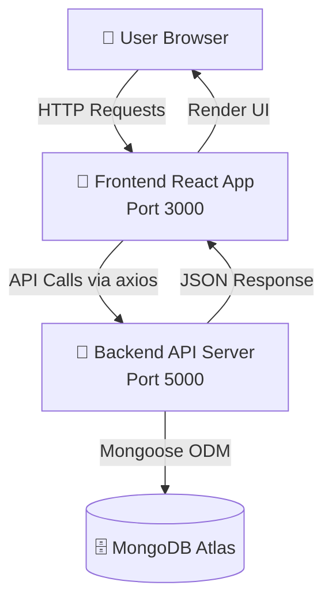
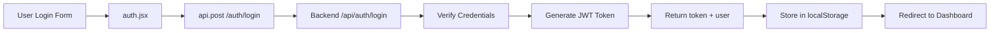
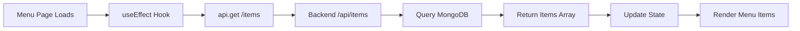
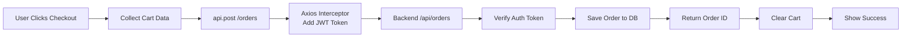

# 🏗️ Backend-Frontend Connection Architecture

## System Overview



---

## Connection Flow

### **1. User Authentication Flow**



### **2. Menu/Products Loading Flow**



### **3. Order Placement Flow**



---

## File Connection Map

### **Frontend → Backend API Connections**

| Frontend File | API Endpoint | Backend Route | Purpose |
|--------------|--------------|---------------|---------|
| `auth.jsx` | `POST /auth/login` | `routes/auth.js` | User login |
| `auth.jsx` | `POST /auth/register` | `routes/auth.js` | User registration |
| `Menu.js` | `GET /items` | `routes/items.js` | Fetch menu items |
| `App.jsx` | `GET /products` | `routes/items.js` | Fetch products |
| `App.jsx` | `POST /orders` | `routes/orders.js` | Create order |
| `Products.jsx` | `GET /products` | `routes/items.js` | Admin: List products |
| `Products.jsx` | `POST /products` | `routes/items.js` | Admin: Create product |
| `Products.jsx` | `PUT /products/:id` | `routes/items.js` | Admin: Update product |
| `Products.jsx` | `DELETE /products/:id` | `routes/items.js` | Admin: Delete product |

---

## API Configuration

### **Central API Instance** (`frontend/src/api/axios.js`)

```
┌─────────────────────────────────────┐
│     Axios Instance Configuration    │
├─────────────────────────────────────┤
│ Base URL: REACT_APP_API_URL         │
│ Default: http://localhost:5000/api  │
├─────────────────────────────────────┤
│ Request Interceptor:                │
│ ✓ Auto-attach JWT token from        │
│   localStorage                       │
├─────────────────────────────────────┤
│ Response Interceptor:               │
│ ✓ Handle 401 errors                 │
│ ✓ Auto-logout on auth failure       │
└─────────────────────────────────────┘
```

---

## Environment Variables Connection

### **Development (Local)**

```
Frontend (.env)                Backend (.env)
┌──────────────────────┐      ┌──────────────────────┐
│ REACT_APP_API_URL    │ ───→ │ PORT=5000            │
│ =localhost:5000/api  │      │ FRONTEND_URL         │
│                      │ ←─── │ =localhost:3000      │
└──────────────────────┘      └──────────────────────┘
```

### **Production (Deployed)**

```
Frontend (.env)                Backend (.env)
┌──────────────────────┐      ┌──────────────────────┐
│ REACT_APP_API_URL    │ ───→ │ PORT=5000            │
│ =backend.render.com  │      │ FRONTEND_URL         │
│ /api                 │      │ =frontend.render.com │
└──────────────────────┘      └──────────────────────┘
```

---

## CORS Configuration

```
Backend server.js
┌────────────────────────────────────┐
│ app.use(cors({                     │
│   origin: FRONTEND_URL,            │
│   credentials: true                │
│ }))                                │
└────────────────────────────────────┘
         │
         ▼
Allows requests from:
✓ http://localhost:3000 (Dev)
✓ https://your-frontend.com (Prod)
```

---

## Authentication Flow Diagram

```
┌─────────────────────────────────────────────────────────┐
│                    Authentication Flow                   │
├─────────────────────────────────────────────────────────┤
│                                                          │
│  1. User Login                                           │
│     └─→ auth.jsx sends credentials                      │
│                                                          │
│  2. Backend validates & generates JWT                    │
│     └─→ Returns: { token, user }                        │
│                                                          │
│  3. Frontend stores in localStorage                      │
│     ├─→ localStorage.setItem('token', token)            │
│     └─→ localStorage.setItem('user', user)              │
│                                                          │
│  4. Subsequent Requests                                  │
│     └─→ Axios interceptor auto-adds:                    │
│         Authorization: Bearer <token>                    │
│                                                          │
│  5. Backend Middleware                                   │
│     └─→ auth.js verifies token                          │
│         ├─→ Valid: Attach user to req.user              │
│         └─→ Invalid: Return 401                         │
│                                                          │
│  6. Frontend handles 401                                 │
│     └─→ Interceptor clears auth & redirects to login    │
│                                                          │
└─────────────────────────────────────────────────────────┘
```

---

## Data Flow: Add to Cart & Checkout

```
┌──────────────┐
│ User clicks  │
│ "Add to Cart"│
└──────┬───────┘
       │
       ▼
┌──────────────────────┐
│ Redux Action         │
│ dispatch(addToCart)  │
└──────┬───────────────┘
       │
       ▼
┌──────────────────────┐
│ cartSlice reducer    │
│ updates cart state   │
└──────┬───────────────┘
       │
       ▼
┌──────────────────────┐
│ Saved to             │
│ localStorage         │
└──────┬───────────────┘
       │
       ▼ (Checkout clicked)
┌──────────────────────┐
│ api.post('/orders')  │
└──────┬───────────────┘
       │
       ▼
┌──────────────────────┐
│ Backend creates      │
│ Order in MongoDB     │
└──────┬───────────────┘
       │
       ▼
┌──────────────────────┐
│ Returns order ID     │
│ Cart cleared         │
└──────────────────────┘
```

---

## Port Configuration

```
Application Ports:
├─ Frontend: 3000 (React Dev Server)
├─ Backend:  5000 (Express Server)
└─ Database: 27017 (MongoDB - Cloud)

Development URLs:
├─ Frontend: http://localhost:3000
├─ Backend:  http://localhost:5000
└─ API:      http://localhost:5000/api
```

---

## Security Features

```
┌─────────────────────────────────────┐
│         Security Layers             │
├─────────────────────────────────────┤
│ 1. CORS Protection                  │
│    ✓ Only allow configured origins  │
├─────────────────────────────────────┤
│ 2. JWT Authentication               │
│    ✓ Token-based auth               │
│    ✓ Expiry handling                │
├─────────────────────────────────────┤
│ 3. Password Hashing                 │
│    ✓ bcrypt encryption              │
├─────────────────────────────────────┤
│ 4. Auth Middleware                  │
│    ✓ Protected routes               │
│    ✓ Role-based access (Admin)      │
└─────────────────────────────────────┘
```

---

## Summary

✅ **Frontend** communicates with **Backend** via axios
✅ **Base URL** configured through environment variables
✅ **Authentication** handled with JWT tokens
✅ **CORS** properly configured for cross-origin requests
✅ **All API calls** centralized in `api/axios.js`
✅ **Automatic token injection** via interceptors
✅ **Error handling** with response interceptors

**Your app is fully connected and ready to use!** 🎉
